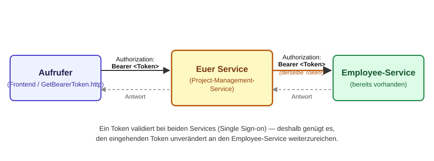

# Authentik in diesem Projekt

Dieses Dokument sagt, wie OAuth2/OIDC in **eurem Project-Management-Service abgebildet wird.**

## Die vier Rollen, konkret

| Rolle | Wer das bei euch ist |
|---|---|
| Resource Owner | ein Mitarbeiter — zum Testen: der Nutzer `john` |
| Client | im echten Betrieb: das Angular-Frontend aus LF10. Zum Testen ohne Frontend: `GetBearerToken.http` |
| Authorization Server | Authentik, läuft lokal über `docker compose up` auf `localhost:9000` |
| Resource Server | **euer** Project-Management-Service — und der bereits vorhandene Employee-Service |

Merkt euch vor allem die letzte Zeile: **Euer Code spielt ausschließlich
Resource Server.** Login, Redirect, Token ausstellen — das alles passiert nie
in eurem Code. Ihr bekommt einen fertigen Token vorgelegt und müsst nur eine
Frage beantworten: *Ist er echt?*

## Wie ihr an einen Token kommt (zum Testen)

Ihr habt kein eigenes Frontend. Deshalb verwendet `GetBearerToken.http` **nicht**
den vollen Authorization-Code-Flow mit Browser-Redirect, sondern den
einfacheren **Password Grant**: Username und Passwort gehen in einem einzigen
POST-Request direkt an den Token-Endpunkt.

```
POST http://localhost:9000/application/o/token/
grant_type=password&username=john&password=<App-Passwort>&client_id=employee_api_client
```

Das ist eine bewusste Abkürzung fürs Testen — **keine** Vorlage für einen
echten Login. Ein echter Nutzer sieht sein Passwort nie im Client-Code stehen;
das leistet der Authorization-Code-Flow mit PKCE, den das noch zu implementierende Frontend verwendet.

Das nötige App-Passwort für `john` ist bereits per Blueprint fest vorgegeben
und steht in [GetBearerToken.http](GetBearerToken.http) — kein manueller
Schritt in der Authentik-Admin-Oberfläche nötig. Wer sich die Konfiguration
trotzdem ansehen will: [Readme.md](Readme.md#admin-oberfläche).

## Wie euer Service einen Token prüft

Das steht in `src/main/java/de/szut/pms/security/AuthentikSecurityConfig.java`:

```java
@Bean
public JwtDecoder jwtDecoder() {
    return NimbusJwtDecoder.withJwkSetUri(jwkSetUri).build();
}
```

`jwkSetUri` zeigt auf `http://localhost:9000/application/o/employee_api/jwks/`
— die öffentlichen Schlüssel, mit denen Authentik seine Tokens signiert. Euer
Service holt sich diese Schlüssel und prüft damit **selbst**, ob die Signatur
eines eingehenden JWT stimmt und ob es noch gültig ist.

**Wichtig:** Das ist *nicht* dasselbe wie **Introspection** (eine andere,
ebenfalls verbreitete Variante, bei der der Resource Server bei jeder Anfrage
aktiv beim Authorization Server nachfragt: "Ist dieser Token noch gültig?").
Bei euch passiert das lokal, ohne Netzwerk-Aufruf pro Anfrage — deshalb
funktioniert die Prüfung auch, wenn Authentik gerade kurz nicht erreichbar
wäre, solange der Token noch gültig ist.

## Single Sign-on

Employee-Service und euer Project-Management-Service validieren gegen
**dieselbe** JWKS-Adresse. Ein Token, der für den einen gültig ist, ist es
auch für den anderen — eine Anmeldung reicht für beide Services. Das ist der
Sinn von Single Sign-on: Nicht jeder Microservice verwaltet eigene Logins.

## Wenn euer Service selbst den Employee-Service aufruft

Manche eurer Endpunkte müssen selbst beim Employee-Service nachfragen — zum
Beispiel um zu prüfen, ob eine angegebene `employeeId` überhaupt existiert.
Der Employee-Service ist genauso abgesichert wie eurer: Auch er verlangt
einen gültigen Bearer-Token im `Authorization`-Header.

Woher nehmt ihr den? Ihr fordert **keinen neuen** Token an. Der Token, mit
dem der Aufrufer eure Anfrage geschickt hat, liegt bereits vor — und dank
Single Sign-on ist genau dieser Token auch beim Employee-Service gültig.
Ihr müsst ihn nur aus der eingehenden Anfrage herausholen und unverändert in
eurer eigenen Anfrage an den Employee-Service wieder mitschicken:



Dieses Muster nennt sich **Token Relay** (auch Token Forwarding/Pass-Through
genannt). Wie ihr in Spring an den Token der eingehenden Anfrage kommt und
ihn in euren ausgehenden Request an den Employee-Service einbaut, ist eure
Aufgabe zu recherchieren — hier steht nur, *dass* und *warum* das nötig ist.

## Was ihr für die Absicherung eurer eigenen Endpunkte tun müsst

Nichts an der Prüfung selbst — nur eure Pfade eintragen, in derselben Datei:

```java
.authorizeHttpRequests(authz -> authz
        .requestMatchers("benötigter Pfad").authenticated()
        .anyRequest().permitAll()
);
```

Achtung: `anyRequest().permitAll()` heißt *offen, sofern nicht explizit
gesperrt* — ein neuer Endpunkt, den ihr vergesst einzutragen, bleibt
ungesichert.
